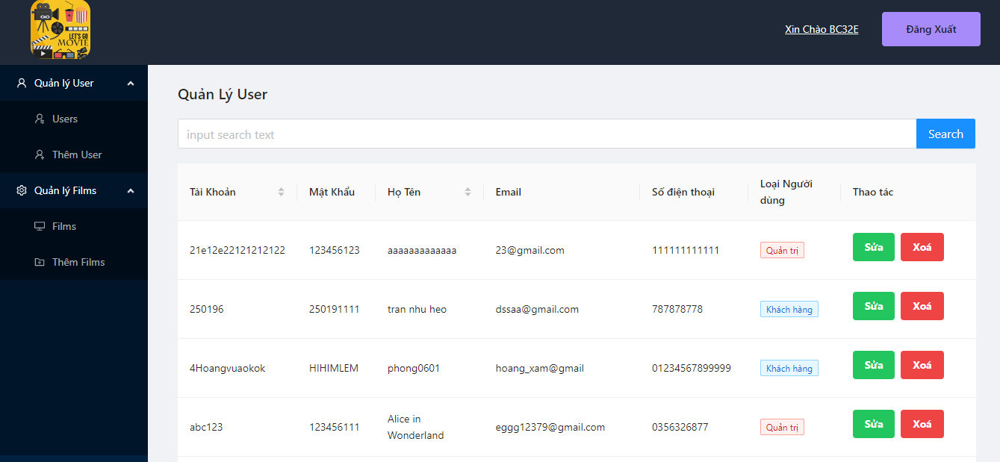

# Movie project

Welcome to the Movie website. This is a project programmed by two web developers, Phat and Phong.
Thank for watching !

<div align="center">
  <a href="https://my-movie-web.vercel.app/">
    
  </a>
  <p align="center">
    <a href="https://my-movie-web.vercel.app/">View Demo</a>/
       <a href="./src/assets/my-movie-web.png">Full Page Screen</a>
  </p>
</div>

<br />

<div align="center">
  
  <p align="center">HomePage</p>
  
  <p align="center">ModalTrailer</p>
  
  <p align="center">DetailPage</p>
  
  <p align="center">BookingPage</p>
  
  <p align="center">AdminPage</p>
</div>

## Install

In the project directory, you can run:

```sh
npm i
npm start
```

Open [http://localhost:3000](http://localhost:3000) to view it in your browser.

## Requests

-   Create an account or you can use :

userAccount (1vanphong1010/123456)

adminAccount(admin005/admin003)

-   You can't access the site AdminPage without an admin account.
-   After logging in, a link to Admin Page will appear in the DropMenu on the right corner of the screen.
-   You can't buy tickets if you are not logged in.

### Third Party libraries used except for React and Tailwind

-   [react-rounter-dom](https://reactrouter.com/en/main)
-   [formik](https://formik.org/)
-   [axios](https://github.com/axios/axios)
-   [antd](https://ant.design/)
-   [react-slick](https://react-slick.neostack.com/)
-   [react-redux](https://react-redux.js.org/)
-   [redux-thunk](https://github.com/reduxjs/redux-thunk)
-   [react-spinners](https://github.com/davidhu2000/react-spinners)
-   [lottie-react](https://github.com/Gamote/lottie-react)

### Todo

-   Use database from to CyberSoft center.
-   MoviePage is written by me and Phat wrote AdminMovie.
-   I call API with Axios and save data in Redux store.
-   Use Redux Thunk as a middleware for data processing then render on the website with ReacHook.
-   Use Tailwind as a primary tool for design UI/UX.

## Description

### AminPage

-   Find user information, register, login and delete.
-   Find film information, create,edit and detele.
-   Create a schedule for the cinema.

### MoviePage

-   Find film information, quick view trailer.
-   Book ticket.
-   View ticket purchase history and edit user information.
